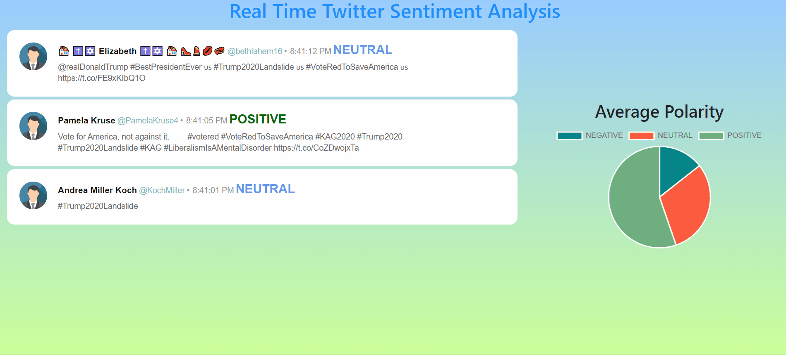

# Deep-Learning

## Sentiment Analysis of Real Time Tweets from Twitter API

This project will analyze the sentiments of users tweet extracted from a real-time twitter api. We have built a Deep learning based LSTM model on google colab using 1.6 million labelled tweet dataset. We have exposed this pre-trained DL model using flask api. Further detail regarding api given below. This deep learning solution is also containerized and available as a docker image stored in docker hub sid94docker/sentimentanalyzer:v1. 

Using twitter official api in nodejs we have consumed the stream of tweets and passed to the Apache Kafka producer. This passed data is consumed by kafka consumer and processed for polarity of the tweets using sentiment analyzer api. Polarity of the tweets will be Negative, Neutral or Positive. This processed tweet data will emitted using eventemitter3 and will be observed by index.js. This processed stream of data then will be sent to UI using a Socket connection which will be extablished using socket.io.

This tweet data is consumed on a React based UI

  #### Technologies :
  Python, Tensorflow, Keras, LSTM, NLP, Flask, Docker, NodeJS, Apache Kafka (NodeJS), Socket.io, Event Emitters, MongoDB, React, HTML, CSS

## Demo


## System Design


## Deep Learning Model Api

Sentiment analysis using Deep Learning. Processed 1.6 Millions labelled tweets using tensorflow

Api will be available on http://localhost:5000/

```
predict() - post method
```

```
http://localhost:5000/predict 
```

Input: 
data to be passed in the format:

```
{
	"tweets": [
		{
			"id": "58723682638226979",
			"text": "First the global coronavirus lockdown, then Trump's visa ban has separated thousands of families..... ||… https://t.co/YHYiR1tsCy"
		},
		{
			"id": "58723682638226979",
			"text": "First the global coronavirus lockdown, then Trump's visa ban has separated thousands of families..... ||… https://t.co/YHYiR1tsCy"
		},
		{
			"id": "58723682638226979",
			"text": "First the global coronavirus lockdown, then Trump's visa ban has separated thousands of families..... ||… https://t.co/YHYiR1tsCy"
		}
	]
}
```

```
id - is the tweet id parameter and from the twitter data
text - is the text parameter from the twitter data
```

preprocess of the twitter tweet text to be done by the api so no need to worry about preprocessing.

Output: 

```
{
    "data": [
        {
            "elapsed_time": 0.39963698387145996,
            "id": "58723682638226979",
            "label": "NEGATIVE",
            "score": 0.21943318843841553,
            "text": "First the global coronavirus lockdown, then Trump's visa ban has separated thousands of families..... ||… https://t.co/YHYiR1tsCy"
        },
        {
            "elapsed_time": 0.3141758441925049,
            "id": "58723682638226979",
            "label": "NEGATIVE",
            "score": 0.21943318843841553,
            "text": "First the global coronavirus lockdown, then Trump's visa ban has separated thousands of families..... ||… https://t.co/YHYiR1tsCy"
        },
        {
            "elapsed_time": 0.21393871307373047,
            "id": "58723682638226979",
            "label": "NEGATIVE",
            "score": 0.21943318843841553,
            "text": "First the global coronavirus lockdown, then Trump's visa ban has separated thousands of families..... ||… https://t.co/YHYiR1tsCy"
        }
    ]
}
```
## Conatinerized the Deep Learning solution

To build a docker image cd into directory of dockerfile

```
run the command "docker build -t sentimentanalyzer:v1 ."
```

```
To run that built images use "docker run --name=sentimentanalyzer -p 5000:5000 sentimentanalyzer:v1" 
```

Now the app will be available on http://localhost:5000/

now use
```
http://localhost:5000/predict  Post method to post tweets data
```


Tag the docker image using

```
docker tag sentimentanalyzer:v1 sid94docker/sentimentanalyzer:v1
```

Push the image to docker hub

```
docker push sid94docker/sentimentanalyzer:v1
```

To run the image from docker hub

```
docker run --name=sentimentanalyzer -p 5000:5000 sid94docker/sentimentanalyzer:v1
```

## Apache Kafka Setup on Windows

### Download apache kafka from 

https://kafka.apache.org/downloads

Install 7zip if you dont have

### extract the package

 1. first time will generate one more archive
 2. extract the new archive

### rename the folder to kafka and place it in c drive

In the folder C:\kafka\config

### search for the lines log.dirs and dataDir in respective files

edit one line in file server.properties - log.dirs=c:/kafka/kafka-logs

edit one line in file zookeeper.properties - dataDir=c:/kafka/zookeeper-data


### first cd into kafka directory c:/kafka

Start zookeeper - keep it running

```
.\bin\windows\zookeeper-server-start.bat .\config\zookeeper.properties
```
start server / broker - keep it running
```
.\bin\windows\kafka-server-start.bat .\config\server.properties
```

create a topic - it will exit
```
.\bin\windows\kafka-topics.bat --create --zookeeper localhost:2181 --replication-factor 1 --partitions 1 --topic testtopic
```

list all the created topics - it will exit
```
.\bin\windows\kafka-topics.bat --list --zookeeper localhost:2181
```

create a producer and enter the input message that will generated and sent to broker by producer
```
.\bin\windows\kafka-console-producer.bat --broker-list localhost:9092 --topic testtopic
```
Consume the stream generated by the producer on the topic testtopics
```
.\bin\windows\kafka-console-consumer.bat --bootstrap-server localhost:9092 --topic testtopic --from-beginning
```

https://stackoverflow.com/questions/47168342/kafka-1-0-stops-with-fatal-shutdown-error-logs-directory-failed


### Steps to run project using docker containers:
1. Create Apache Kafka network
```
docker network create kafka-network
```
2. To start Apache Kafka broker and zookeeper, open terminal go to "cd SentimentAnalysis/KafkaBroker/ " and run below command 

```
docker-compose -f docker-compose.kafka.yml up
```
3. Now, open another terming and go to "cd SentimentAnalysis/" folder and run below command in order to start Apache Kafka Producer, Consumer, twitter UI, MongoDB and Deep Learning model to analyze tweet using docker-compose

```
docker-compose up
```
4. Open any browser and enter below url. 

```
http://localhost:3000/
```

To stop running docker containers
```
docker-compose -f docker-compose.kafka.yml down
docker-compose down
```
To list created docker network

```
docker network ls
```
